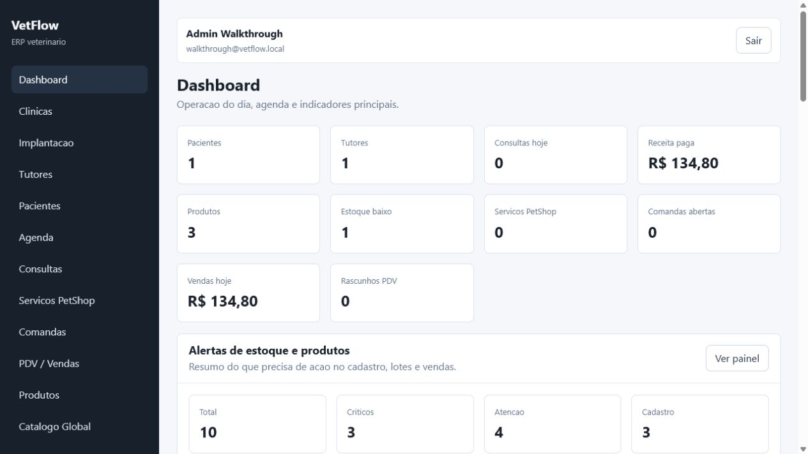

# VetFlow

VetFlow is a Laravel-based ERP for veterinary clinics, pet shops, and integrated operations.

The project is designed as a multi-clinic system, with separated operational data per clinic and a modular backend that can grow without turning each feature into a tightly coupled block.

## Current Status

Active development. The repository already contains the core Laravel application, modular business areas, database migrations, authentication/authorization hardening, and feature tests for the first operational flows.

For the current working state, read [STATUS.md](STATUS.md).

## Main Capabilities

- Multi-clinic foundation.
- Users, roles, permissions, and active-user access checks.
- Clinics, tutors, patients, schedules, and appointments.
- Products, inventory, suppliers, purchase entries, and product intelligence.
- Pet shop services, service orders, sales, payments, and cash register closure.
- Financial transactions and dashboard services.
- Assisted CSV and Excel onboarding with durable import history.
- GTIN/product lookup support and NF-e purchase-entry import services.

## Stack

- PHP 8.2+
- Laravel 12
- SQLite for local development by default
- MySQL-compatible architecture for production evolution
- Blade
- Vite
- PHPUnit

## Project Structure

```text
app/
  Core/                 Shared infrastructure
  Modules/              Business modules
database/
  migrations/           Database schema history
docs/                   Architecture, audit, and domain documentation
resources/
  css/
  js/
  views/
routes/
tests/
```

## Local Setup

```bash
composer install
npm install
cp .env.example .env
php artisan key:generate
php artisan migrate
npm run build
php artisan serve
```

For an integrated development run, the Composer `dev` script starts the Laravel server, queue listener, and Vite together:

```bash
composer run dev
```

## Validation

Run the backend test suite:

```bash
php artisan test
```

Build frontend assets:

```bash
npm run build
```

Clear cached Laravel state when diagnosing local behavior:

```bash
php artisan optimize:clear
```

## Documentation

- [Documentation index](docs/README.md)
- [Project context](docs/PROJECT_CONTEXT.md)
- [Visual walkthrough](docs/WALKTHROUGH.md)
- [System architecture](docs/ARQUITETURA.md)
- [Backend architecture](docs/backend-architecture.md)
- [Frontend architecture](docs/frontend-architecture.md)
- [Database documentation](docs/BANCO_DE_DADOS.md)
- [Module index](docs/modules/_INDEX.md)
- [Roadmap](docs/ROADMAP.md)
- [CI guide](docs/ci.md)
- [Deployment guide](docs/deployment.md)
- [Release checklist](docs/release-checklist.md)
- [Engineering process](docs/engineering-process.md)
- [GitHub VetFlow comparison audit](docs/audits/github-vetflow-comparison-2026-07-21.md)

## Visual Preview

The repository includes a short walkthrough with real application screenshots generated from fictitious demo data.

[Open the visual walkthrough](docs/WALKTHROUGH.md)



## Project Governance

- [Contributing guide](CONTRIBUTING.md)
- [Security policy](SECURITY.md)
- GitHub issue templates for bugs, feature requests, and documentation tasks.
- GitHub pull request checklist for validation, tenant safety, and release hygiene.

## Development Principles

- Business rules live in modules.
- Controllers coordinate requests and responses, not complex business logic.
- Services own orchestration and business behavior.
- Repositories own data access where meaningful.
- Cross-module communication should happen through services, contracts, events, or DTOs.
- Sensitive local data, including cached NF-e XML files, must not be committed.

## License

Proprietary.
