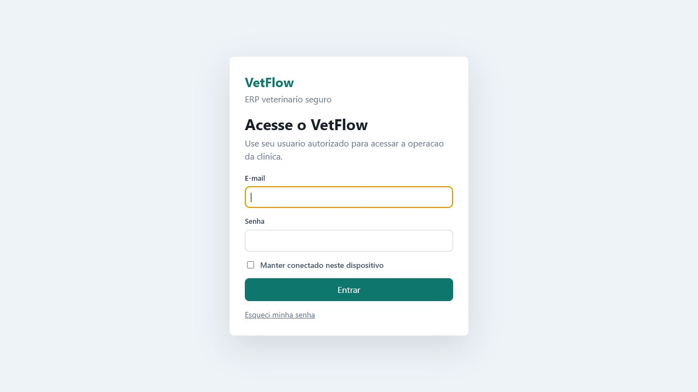
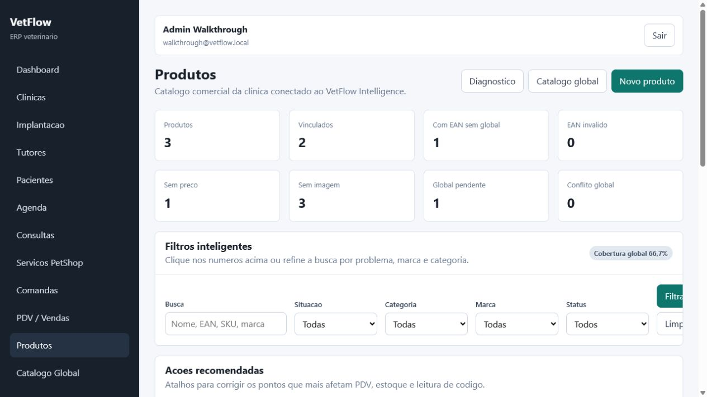
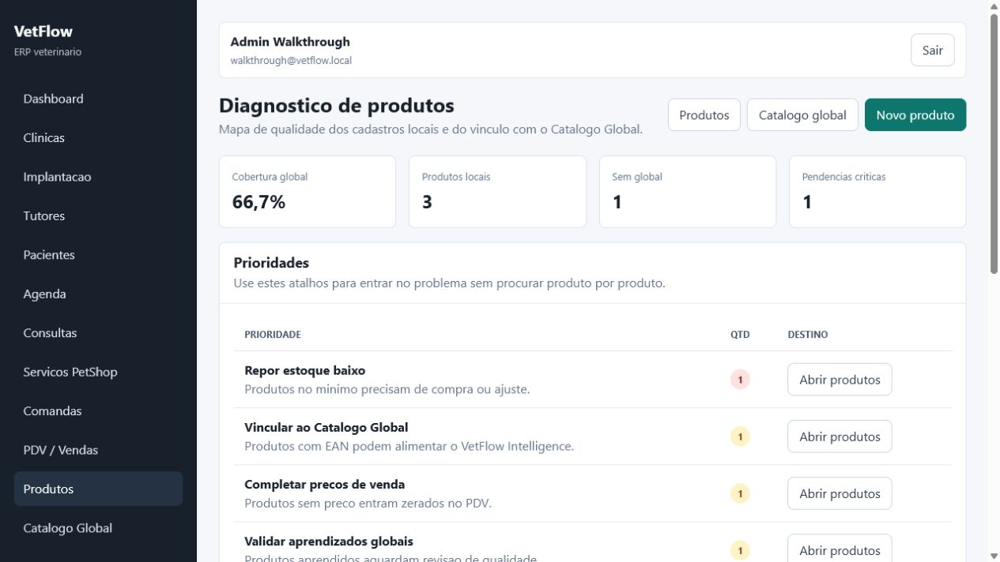
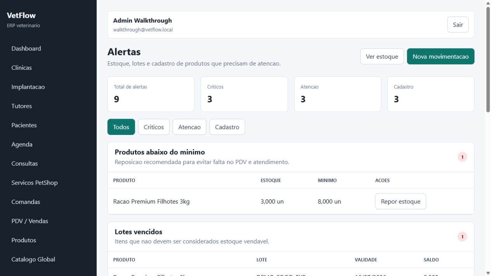
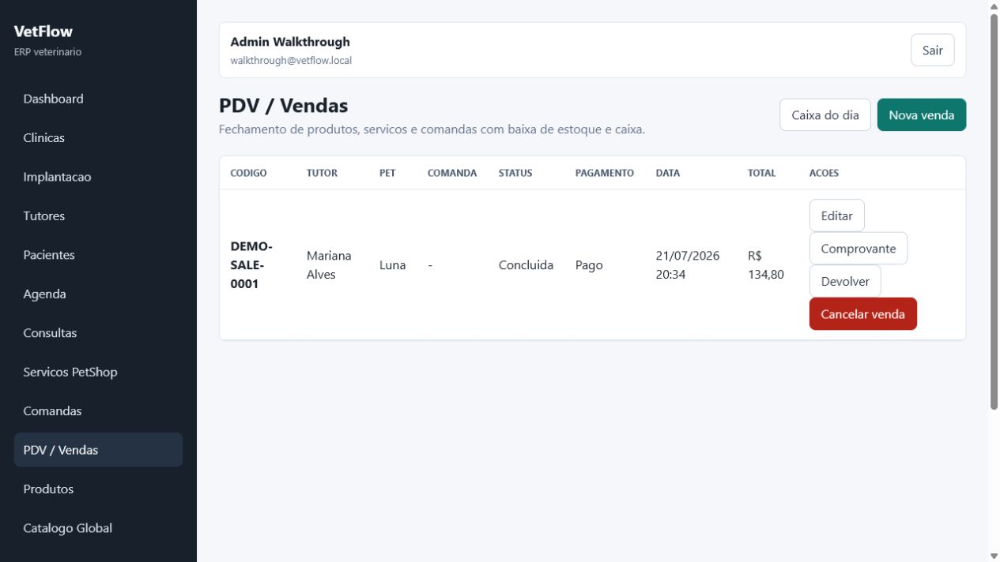
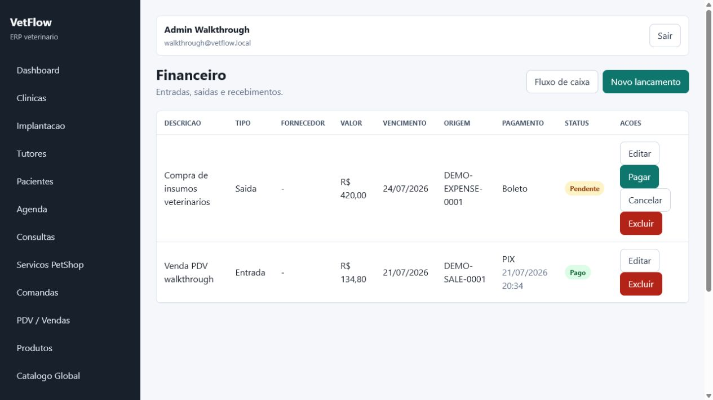

# VetFlow Visual Walkthrough

Updated: 2026-07-21

This walkthrough shows the current VetFlow interface with fictitious data generated by `WalkthroughDemoSeeder`. The screenshots are meant for repository review, onboarding, and product direction discussions.

## Reproducing The Demo Data

Run the optional walkthrough seeder in a local development database:

```bash
php artisan migrate
php artisan db:seed --class=WalkthroughDemoSeeder
```

Demo login:

```text
E-mail: walkthrough@vetflow.local
Password: VetFlowDemo123!
```

The seeder is intentionally not called by `DatabaseSeeder`. It only runs when requested and creates fictitious records for clinic setup, tutor/patient journey, product intelligence, inventory alerts, sales, and financial entries.

## 1. Login

Secure access starts with the authorized clinic user.



## 2. Dashboard

The dashboard combines clinic operation, sales, stock, financial signals, and VetFlow Intelligence in one place.


## 3. Products And Intelligence

The product list surfaces catalog coverage, GTIN/EAN quality, missing prices, missing images, low stock, and links to the global product catalog.



## 4. Product Diagnostics

The diagnostics screen helps prioritize data-quality improvements that affect PDV, stock, and product lookup reliability.



## 5. Inventory Alerts

The alert panel groups low stock, expired lots, expiring lots, untracked stock, missing prices, and missing images.



## 6. Sales

The PDV list shows completed sales with tutor, patient, payment, receipt, return, and cancellation paths.



## 7. Financial

Financial records connect income, expenses, payment status, due dates, and operational references.



## Notes

- All data shown here is fictitious.
- Screenshots should be refreshed after relevant UI changes.
- The walkthrough should stay concise; detailed behavior belongs in module docs.

